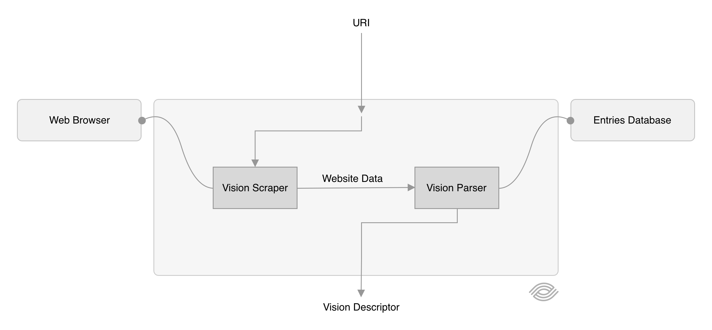

<p align="center"> 
    
</p>

# Vision
Vision is the most powerful software detecting technologies and
services used on websites like web frameworks, web services,
server software, libraries, widgets, content management systems, social platforms,
e-commerce platforms, analytics software and more.

Through Vision you can:
-   **Reliably detect technologies and services used in websites**
through a list of patterns constantly updated and maintained.
-   **Define new technologies and services easily without technical knowledge**: you can detect
a JavaScript library by just adding its file name.
-   **Have maximum flexibility for defining how technologies and
services are detected**: from a wide range of intuitive
predefined patterns to custom JavaScript code.
-   **Have specific information for each technology or service detected**:
for instance if Vision finds `Google Analytics` you can get the tracking ID of
the specific user, if Vision finds `Twitter Follow Button`
you can get the username of the specific user to follow.
-   **Have atomic definitions**, for instance `Facebook Like Button`
and `Facebook Share Button` are clearly distinguished and not superficially
defined as just `Facebook`.

## Usage
Using NodeJS with ES5
```javascript
const Vision = require("vision");

Vision.cast("https://www.example.com").then((descriptor) => {
    console.log(descriptor);
});
```

Using NodeJS with ES6
```javascript
import { Vision } from "vision";

async function myApplication () {
    const descriptor = await Vision.cast("https://www.example.com");

    console.log(descriptor);
}
```

Using NodeJS with TypeScript
```typescript
import { Vision, VisionDescriptor } from "vision";

async function myApplication (): Promise<void> {
    const descriptor: VisionDescriptor  = await Vision.cast("https://www.example.com");

    console.log(descriptor);
}
```

### What happens inside
<p align="center">
    
</p>

## Entries
**A entry is a technology or service that can be identified by Vision**. This software relies on a
list of entries updated and maintained by the community and the author. You can also define
and detect your custom entries.

### How to add a new entry
TBD.

## Fingerprint
A fingerprint is a pattern composed by a set of inner patterns used as models
to detect a technology or service in a website, a fingerprint is usually associated to a entry and
the matching of a fingerprint means the matching of the associated entry.
Below the models you can use to compose a fingerprint.

#### `headers`
A key-value pair set used to match headers in the HTTP response of the website request.
In case at least one key-value pair is matched then the entry is matched.

<details>
    <summary>Usage Example</summary>
    <br>

```javascript
{
    name: "Entry Example",
    description: "This entry is used for fingerprint usage examples.",
    fingerprint: {
        headers: {
            "header-name-regex": "header-value-regex",
            "header-name-regex": "header-value-regex",
            // ...
        },
    },
},
```
</details>

---

#### `initialContent`
List of regular expressions used to match the website source code (the HTTP response body). In case at least one regular expression is matched then the entry is matched.

<details>
    <summary>Usage Example</summary>
    <br>

```javascript
{
    name: "Entry Example",
    description: "This entry is used for fingerprint usage examples.",
    fingerprint: {
        initialContent: [
            "regex",
            "regex",
            // ...
        ],
    },
},
```
</details>

---

#### `loadedContent`
List of regular expressions used to match the website source code after the "load" event. In case at least one regular expression is matched then the entry is matched.

<details>
    <summary>Usage Example</summary>
    <br>

```javascript
{
    name: "Entry Example",
    description: "This entry is used for fingerprint usage examples.",
    fingerprint: {
        loadedContent: [
            "regex",
            "regex",
            // ...
        ],
    },
},
```
</details>

---

#### `selectors`
List of CSS selectors, the selectors are queried after the "load" event. In case at least one queried selector returns at least one element then the entry is matched.

<details>
    <summary>Usage Example</summary>
    <br>

```javascript
{
    name: "Entry Example",
    description: "This entry is used for fingerprint usage examples.",
    fingerprint: {
        selectors: [
            ".selector",
            "#selector",
            "a.complex[selector]",
            // ...
        ],
    },
},
```
</details>

---

#### `scripts::sources`
List of regular expressions used to match the value of the "src" attribute of all script elements. The regular expressions are evaluated after the "load" event. In case at least one regular expression is matched then the entry is matched.

<details>
    <summary>Usage Example</summary>
    <br>

```javascript
{
    name: "Entry Example",
    description: "This entry is used for fingerprint usage examples.",
    fingerprint: {
        scripts: {
            sources: [
                "regex",
                "regex",
                // ...
            ],
        },
    },
},
```
</details>

---

#### `scripts::contents`
List of regular expressions used to match the inner value of all script elements without the "src" attribute. The regular expressions are evaluated after the "load" event. In case at least one regular expression is matched then the entry is matched.

<details>
    <summary>Usage Example</summary>
    <br>

```javascript
{
    name: "Entry Example",
    description: "This entry is used for fingerprint usage examples.",
    fingerprint: {
        scripts: {
            contents: [
                "regex",
                "regex",
                // ...
            ],
        },
    },
},
```
</details>

---

#### `scripts::globalDeclarations`
List of regular expressions used to match the keys created by scripts in the window object. The regular expressions are evaluated after the "load" event. In case at least one regular expression is matched then the entry is matched. Note that only properties of the window object can be matched, and not, for example, a property of a property of the window object (if you need to do this please refer to the `customEvaluation/match` pattern model).

<details>
    <summary>Usage Example</summary>
    <br>

```javascript
{
    name: "Entry Example",
    description: "This entry is used for fingerprint usage examples.",
    fingerprint: {
        scripts: {
            globalDeclarations: [
                "global-name-regex",
                "global-name-regex",
                // ...
            ],
        },
    },
},
```

How to detect `jQuery`.
```javascript
{
    name: "jQuery",
    description: "",
    fingerprint: {
        scripts: {
            globalDeclarations: [
                "^jQuery$",
            ],
        },
    },
},
```
The `^` and `$` symbols are regular expression operators used to make sure the matched key is exactly "jQuery" and not for instance "aaajQuerybbb".
</details>

---

#### `styles::sources`
List of regular expressions used to match the value of the "href" attribute of all style sheet links. The regular expressions are evaluated after the "load" event. In case at least one regular expression is matched then the entry is matched.

<details>
    <summary>Usage Example</summary>
    <br>

```javascript
{
    name: "Entry Example",
    description: "This entry is used for fingerprint usage examples.",
    fingerprint: {
        styles: {
            sources: [
                "regex",
                "regex",
                // ...
            ],
        },
    },
},
```
</details>

---

#### `styles::contents`
List of regular expressions used to match the inner value of all style elements. The regular expressions are evaluated after the "load" event. In case at least one regular expression is matched then the entry is matched.

<details>
    <summary>Usage Example</summary>
    <br>

```javascript
{
    name: "Entry Example",
    description: "This entry is used for fingerprint usage examples.",
    fingerprint: {
        styles: {
            contents: [
                "regex",
                "regex",
                // ...
            ],
        },
    },
},
```
</details>

---

#### `metas`
List of regular expressions used to match meta elements. The regular expressions are evaluated after the "load" event. In case at least one regular expression is matched then the entry is matched.

<details>
    <summary>Usage Example</summary>
    <br>

```javascript
{
    name: "Entry Example",
    description: "This entry is used for fingerprint usage examples.",
    fingerprint: {
        metas: {
            "meta-name-regex": "meta-value-regex",
            "meta-name-regex": "meta-value-regex",
            // ...
        },
    },
},
```
</details>

---

#### `cookies`
A key-value pair set used to match cookies created in the website.
In case at least one key-value pair is matched then the entry is matched.

<details>
    <summary>Usage Example</summary>
    <br>

```javascript
{
    name: "Entry Example",
    description: "This entry is used for fingerprint usage examples.",
    fingerprint: {
        cookies: {
            "cookie-name-regex": "cookie-value-regex",
            "cookie-name-regex": "cookie-value-regex",
            // ...
        },
    },
},
```
</details>

---

#### `localStorage`
A key-value pair set used to match local storage created in the website.
In case at least one key-value pair is matched then the entry is matched.

<details>
    <summary>Usage Example</summary>
    <br>

```javascript
{
    name: "Entry Example",
    description: "This entry is used for fingerprint usage examples.",
    fingerprint: {
        localStorage: {
            "storage-name-regex": "storage-value-regex",
            "storage-name-regex": "storage-value-regex",
            // ...
        },
    },
},
```
</details>

---

#### `links`
List of regular expressions used to match the value of the "href" attribute of all links (<a>). In case at least one regular expression is matched then the entry is matched.

<details>
    <summary>Usage Example</summary>
    <br>

```javascript
{
    name: "Entry Example",
    description: "This entry is used for fingerprint usage examples.",
    fingerprint: {
        links: [
            "regex",
            "regex",
            // ...
        ],
    },
},
```
</details>

---

#### `images`
List of regular expressions used to match the value of the "src" attribute of all images (). In case at least one regular expression is matched then the entry is matched.

<details>
    <summary>Usage Example</summary>
    <br>

```javascript
{
    name: "Entry Example",
    description: "This entry is used for fingerprint usage examples.",
    fingerprint: {
        images: [
            "regex",
            "regex",
            // ...
        ],
    },
},
```
</details>

---

#### `frames`
List of regular expressions used to match the value of the "src" attribute of all frames (<iframe>). In case at least one regular expression is matched then the entry is matched.

<details>
    <summary>Usage Example</summary>
    <br>

```javascript
{
    name: "Entry Example",
    description: "This entry is used for fingerprint usage examples.",
    fingerprint: {
        frames: [
            "regex",
            "regex",
            // ...
        ],
    },
},
```

How to detect `Twitter Follow Button`.
```javascript
{
    name: "Twitter Tweet Button",
    description: "A button exposed for sharing content on Twitter.",
    categories: [
        "Widgets", "Social Networks",
    ],
    uri: "https://developer.twitter.com/en/docs/twitter-for-websites/tweet-button/overview.html",
    fingerprint: {
        frames: [
            "^https://platform.twitter.com/widgets/tweet_button",
        ],
    },
},
```
The `^` symbol is a regular expression operator used to make sure the source of the iframe starts with the specified link.
</details>

---

#### `customEvaluation::match`
A custom JavaScript function evaluated on the visited website. In case the function returns `true` then the entry is matched.
Useful in case the predefined patterns are not enough.

<details>
    <summary>Usage Example</summary>
    <br>

```javascript
{
    name: "Entry Example",
    description: "This entry is used for fingerprint usage examples.",
    fingerprint: {
        customEvaluation: {
            match: () => {
                // Custom Code...
            },
        },
    },
},
```

How to detect `jQuery`.
```javascript
{
    name: "Entry Example",
    description: "This entry is used for fingerprint usage examples.",
    fingerprint: {
        customEvaluation: {
            match: () => {
                return typeof window.jQuery === "function";
            },
        },
    },
},
```
</details>

## Changelog

#### 0.1.0
Vision.